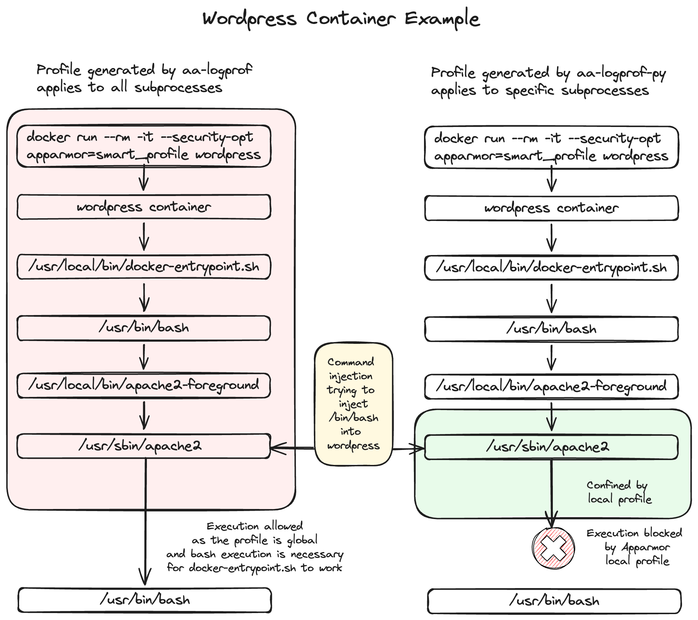

# Smart AppArmor Profile Generator

## Overview

This Python script automates the generation of AppArmor profiles from audit logs, focusing on features not typically handled by the stock aa-logprof tool. Unlike aa-logprof, this script can process logs **detailing subprocess activities**, which is particularly useful for **constraining processes within Docker containers**. It extracts necessary security information from these logs and outputs a tailored AppArmor profile, enhancing system security by defining specific resource access permissions for applications. Importantly, **it confines subprocesses using AppArmor local profiles**, allowing for fine-grained control over application behavior.

## Prerequisites

- Python 3.x
- AppArmor utilities installed on your Linux distribution

## Installation

No installation is required. You only need to have Python and AppArmor on your system. You can run the script directly from the command line.


## Usage

To use the script, you need to specify the input log file and the output profile file name as command line arguments.

```bash
python3 aa-logprof.py example/audit.log example/smart_profile
```

Afterward, you might want to clean up the profile a bit and summarize the paths. ChatGPT is here to help.

### Arguments

- `input_log`: The path to the audit log file you want to process.
- `output_profile`: The desired filename for the generated AppArmor profile.

## How It Works
1. **Parsing Logs:** The script reads the provided audit log, identifying security-related entries such as capabilities and file access permissions.
2. **Determining Executions:** It identifies execution transitions within the logs to handle profiles correctly when applications execute other binaries.
3. **Filtering and Compiling Rules:** The script filters out common paths and includes necessary AppArmor abstractions based on the accessed resources.
4. **Profile Generation:** Finally, it compiles all extracted data into a valid AppArmor profile format and writes it to the specified output file.

## Output

The script outputs a `.profile` file that is ready to be used with AppArmor. This profile contains all the necessary rules derived from the audit logs to restrict application behaviors according to the observed activities.


## Docker Support

The script effectively handles audit logs from Docker containers, tracking subprocesses and their security configurations. This feature is crucial for deploying secure containers in production environments, ensuring that Dockerized applications comply with strict security policies. The use of local profiles for subprocesses enhances the precision of security constraints, enabling detailed management of permissions at the subprocess level.

     apparmor_parser -r -W example/smart_profile
     docker run --rm -it --security-opt apparmor=smart_profile wordpress



## KEV List


With the recent surge in command injections being exploited in the wild, like those highlighted in the latest vulnerability list by CISA, I felt compelled to contribute a solution.

## Auditing using Apparmor

     apt install apparmor-utils auditd -y
     aa-status
     echo "" > /var/log/audit/audit.log

Base profile for auditing YOU need to create this (ensure you `audit` so you get logs)

     apparmor_parser -r wordpress

Start your container YOU need to create a `docker-compose.yml` for this

     docker compose up wordpress


## Note

Ensure that the audit logs provided contain detailed information for accurate profile generation. Incomplete or non-detailed logs may result in less effective security profiles.

More about [Local Profiles](https://documentation.suse.com/sles/12-SP5/html/SLES-all/cha-apparmor-profiles.html#sec-apparmor-profiles-types-local)